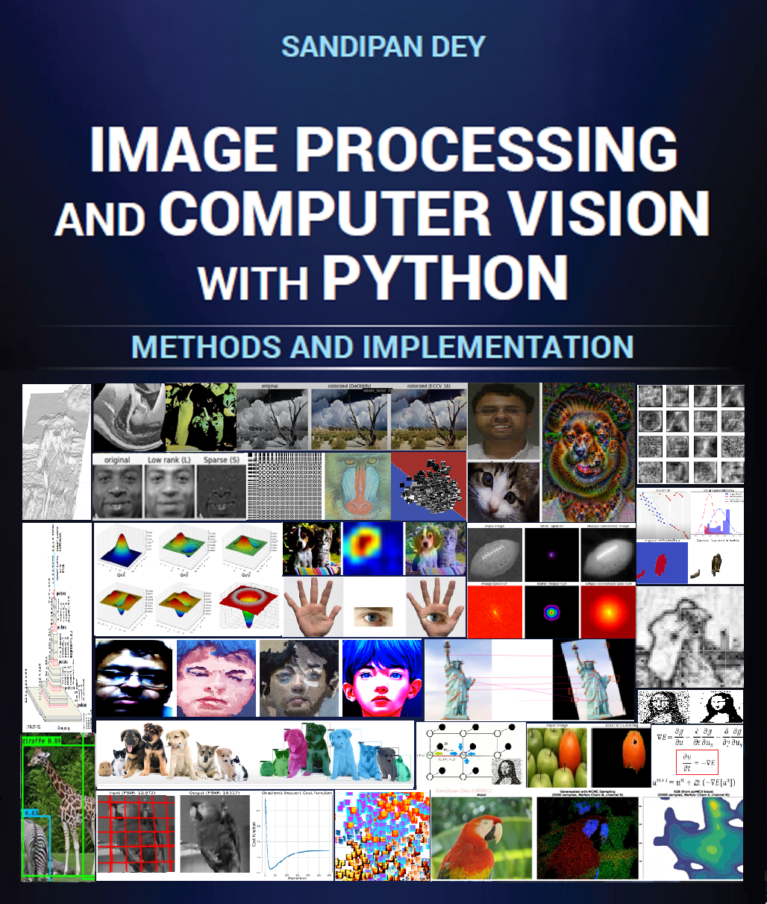

# Image Processing and Computer Vision: Methods and Implementation
To be Published by Wiley

## Book Chapters

1.	Classical Methods in Image Processing
2.	Machine learning Methods in Image Processing
3.	Optimization Methods in Image Processing and Computer Vision
4.	Variational Methods in Image Processing and Computer Vision
5.	Deep Learning Methods in Image Processing and Computer Vision
6.	Bayesian Methods in Image Processing and Computer Vision
7.	Evolutionary Computation Methods in Image Processing
8.	Additional Topics in Image Processing and Computer Vision

